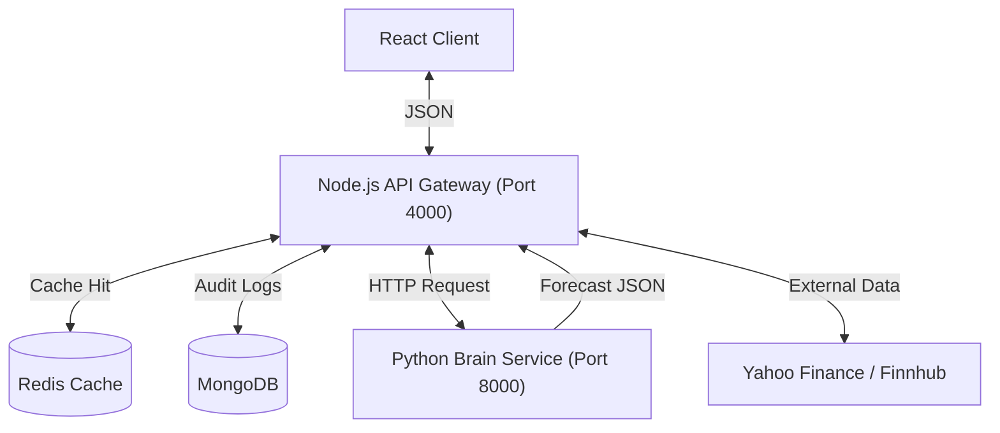

# 🧠 NeuralTrade: AI-Powered Financial Intelligence Terminal


> **"Where Market Reality meets the Neural Horizon."**

**NeuralTrade** is a sophisticated financial intelligence platform designed to bridge the gap between real-time market data and AI-generated future predictions. Unlike standard dashboards that only show historical data, NeuralTrade uses a dedicated **Python AI Microservice** running **Facebook Prophet** to project price movements 24 hours into the future.

The system features a unique **"Unified Horizon"** charting engine that mathematically "welds" historical data with future predictions, creating a seamless visualization of the asset's potential path. It also includes a self-auditing **"Truth Loop"** that verifies its own predictions against actual market outcomes, assigning a dynamic **Accuracy Score** to the system.

## 🛠 Architecture

NeuralTrade operates on a **Microservice Architecture**, separating the "Orchestrator" (Node.js) from the "Brain" (Python).


# 🛠️ NeuralTrade Setup Guide

Follow these steps to run **NeuralTrade** locally.

## 📋 Prerequisites
* **Node.js** (v18+)
* **Python** (v3.9+)
* **MongoDB** (Running locally or Atlas URI)
* **Redis** (Running locally or Upstash URI)

---

## 🚀 Installation Steps

### 1. Clone the Repo
```bash
git clone https://github.com/abhishek2005git/NeuralTrade
cd NeuralTrade
```
### 2. Backend Setup (Node.js)
```bash
cd backend
npm install
```
Create a .env file in the backend/ folder:
```bash
PORT=4000
MONGO_URI=mongodb+srv://<your_user>:<your_pass>@cluster.mongodb.net/neuraltrade
PYTHON_BRAIN_URL=[http://127.0.0.1:8000](http://127.0.0.1:8000)
JWT_SECRET=your_super_secret_jwt_key
FMP_API_KEY=your_fmp_api_key
FINNHUB_KEY=your_finnhub_api_key
REDIS_URL=redis://127.0.0.1:6379
```
### 3. AI Engine Setup (Python)
```bash
cd ../brain

# Create virtual environment
python -m venv venv

# Activate it
# Windows:
venv\Scripts\activate
# Mac/Linux:
source venv/bin/activate

# Install requirements
pip install -r requirements.txt
```
### 4. Frontend Setup (React)
```bash
cd ../frontend
npm install
```
Create a .env file in the frontend/ folder:
```bash
VITE_BACKEND_URL=http://localhost:4000/api
VITE_FINNHUB_KEY=your_finnhub_api_key
```
---
⚡ How to Run (3 Terminals)
You need 3 separate terminals running at the same time:

Terminal 1: Python Brain
```bash
cd brain
source venv/bin/activate
uvicorn main:app --reload --port 8000
# OR: python app.py
```
Terminal 2: Node Backend
```bash
cd backend
npm run dev
```
Terminal 3: React Frontend
```bash
cd frontend
npm run dev
```
Open your browser to http://localhost:5173.
